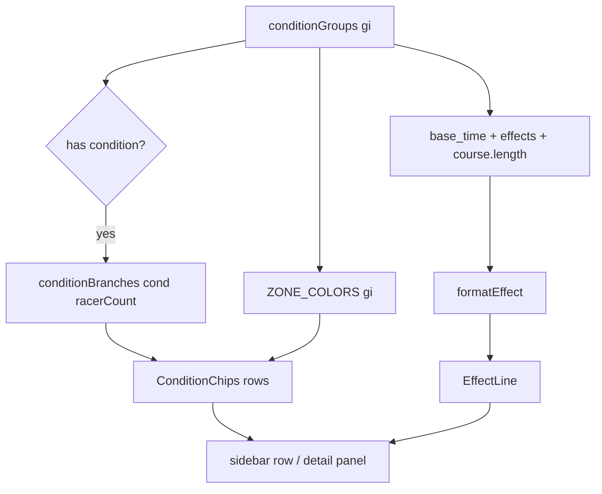

# Design: Condition Renderer — Multi-line Chips + Effect

## 1. Overview

The Visualizer currently renders each skill condition group as a flat `When: A and B and C or D...` string. This design replaces that with a structured chip UI:

- One **row per `@` (OR) alternative**, prefixed with a **zone-tinted color box**.
- Each row's `&` (AND) terms render as **inline chips** that wrap.
- The **effect** for the group (`+0.45 m/s for 6s`) renders under the chips, duration scaled by the selected course length.
- The precondition ("Needs:") gets the same chip treatment.

## 2. Architecture

The change splits along the existing pure-engine vs. component boundary:

```
lib/skill-engine/describe.ts   (pure TS, no React)
  conditionBranches(str, racerCount?) -> { branches: string[][], when: string }
  formatEffect(effect, courseLength)  -> string   (new)
  SkillEffect / effectTypeName map    (new, pure data)

components/track-view.tsx      (React)
  <ConditionChips rows={branches} needs={needsBranches} color tint / muted />
  <EffectLine effect={...} />          (inline in detail panel; sidebar too)
```

- **`conditionBranches`** already exists (added during planning): splits on `@` → rows, then `&` → chips, reusing the keyword dictionary + `racerCount` threading. `.when` flat string retained for backward compat (AC-05).
- **`formatEffect` + effect-type map** are new pure-TS additions to `describe.ts` (or a small sibling), keeping `lib/skill-engine/` free of React (TC-02).

### Data flow

```
SkillDetail.conditionGroups[gi]
  ├─ condition        → conditionBranches(condition, racerCount) → rows/chips
  ├─ precondition     → conditionBranches(precondition, racerCount) → rows/chips (muted)
  ├─ base_time + effects[] → formatEffect → "+0.35 m/s for 2.4 s"
  └─ zone index gi    → ZONE_COLORS[gi]  (track-render.ts) → row color box
```

## 3. Component: `ConditionChips`

Rendered identically in the **sidebar skill list** and the **detail panel**, differing only in container width (both wrap — AC-03).

```
Row layout (one per @-branch):
  [color box]  OR   chip1  chip2  chip3 ...
                     (wraps to next line on overflow)
```

- Color box: 10px square, `background: ZONE_COLORS[gi]` at ~30% alpha with a solid border (matches existing zone swatch in the detail panel). When the group has **no regions on this course** (AC-08), use `rgba(161,161,170,0.3)` (zinc) instead.
- Chip: `rounded border border-zinc-200 bg-zinc-50 px-1.5 py-0.5 text-[11px] leading-4 text-zinc-600`.
- OR prefix: `text-[10px] font-semibold uppercase text-zinc-400`, shown only on rows after the first (first row is implicit "When: ...").
- "Needs:" rows reuse the same chips in muted zinc, under a `text-zinc-400` label.
- Wrapping: chips flow via `flex flex-wrap`; no truncation (AC-03).

## 4. Effect rendering

### 4.1 `formatEffect(effects: SkillEffect[], baseTime: number | undefined, courseLength: number): string`

Returns a single human line, e.g. `+0.45 m/s for 6s`. Rules:

- **Duration** (for timed effects with a positive `base_time`):

  Per §Skill Duration (Race Mechanics doc line 613): `Duration = BaseDuration × CourseDistance[m] / 1000`
  `base_time` is in hundredths of a second (`÷10000` → seconds). Combined:
  ```
  durationS = base_time × courseLength / 10_000_000
  ```
  Rounded to one decimal (`X.X s`). `durationS ≤ 0` → no duration shown.
  `base_time === null` → omit duration (can't fabricate a trustworthy number).
  `base_time === -1` → passive/instant → no duration.

  *Verified:* `base_time=24000` → `24000 × 1000 / 10_000_000 = 2.4 s` ✓ matches the source display "Base duration: 2.4 s".

- **Magnitude/unit per type** (from the `SkillType` enum in `uma-tools/RaceSolver.ts` + mechanics doc). Speed/accel values scale ÷10000 → 0.XX m/s:

  | type | name | value scaling | display |
  |---|---|---|---|
  | 27 | TargetSpeed | ÷10000 m/s | `+0.35 m/s` |
  | 31 | Accel | ÷10000 m/s² | `+0.20 m/s²` |
  | 22 | CurrentSpeedWithNaturalDeceleration | ÷10000 m/s | `+0.35 m/s` |
  | 21 | CurrentSpeed | ÷10000 m/s | `+0.20 m/s` |
  | 9 | Recovery | raw HP count | `+350 HP` |
  | 1–5, 8 | stat-ups | raw value | `+600 Guts` |
  | 10, 14 | start delay | label | `start delay ×0.4` |
  | 28 | LaneMoveSpeedUp | raw | `lane +value` |
  | 37, 42 | internal mechanics | — | hide from effect list |

  *Verified:* "Increase Target Speed (0.35)" → type 27 value `3500` → `0.35 m/s` ✓. Unknown type → raw `type:{type} value:{value}` fallback, never throws.

- **Sign**: `+` for positive, `−` for negative (e.g. type 21 Clever Cornerer × value=`−2000` → `−0.20 m/s`).
- **Multiple effects** (same type stacks): join with `, `. Show all (rarely more than 2).

### 4.2 Placement

Under the chips in both the sidebar row and the detail panel:

```
  □ OR  [Running as a pace chaser]  [Mid-race]  [Just got passed]  [After 5s]
       +0.45 m/s for 6s          ← effect line under chips
```

Sidebar keeps it compact (`text-[11px] text-zinc-500`); detail panel shows it slightly larger.

## 5. Files touched

| File | Change |
|---|---|
| `lib/skill-engine/describe.ts` | add `SkillEffect` type, effect-type display map, `formatEffect()`. `conditionBranches` already present. |
| `components/track-view.tsx` | add `ConditionChips` + `EffectLine` render (inline in file — no new component files); wire both call sites (~sidebar row, ~detail panel) with `ZONE_COLORS[gi]` tint + `course.length` for duration. |
| `lib/skill-engine/describe.test.ts` | add tests: `conditionBranches` branch/chip split, `formatEffect` duration math + type formatting + never-throws. |
| `CLAUDE.md` | one line: effect rendering + chips. |

No new dependencies (AC-06). `zones.ts` untouched.

## 6. Mermaid: rendering flow



## 7. Edge cases handled

- Single condition, no `@` → one row, one chip (EC-01).
- Empty/null condition → no chips (EC-02).
- Malformed → raw-text single chip (EC-03).
- No precondition → no "Needs:" section (EC-04).
- Zone doesn't fire on course → muted zinc tint (AC-08).
- `base_time` missing / negative / zero-duration → duration suppressed or defaulted as above.
- Unknown effect type → raw fallback, never throws.
- Long AND chains wrap (AC-03); racerCount still threads through both branches and duration uses current `course.length` (TC-04).

## 8. Verification

- `bun test` (add `conditionBranches` + `formatEffect` cases).
- `npx tsc --noEmit`, `bun run build`.
- Manual: select a skill with `@`-branches (e.g. It's Going to Be Me) → chips + effect line in sidebar and detail; change Racers count → positions update in chips; change course → effect duration updates; passive skills (Right Turns ◎) show no duration.
